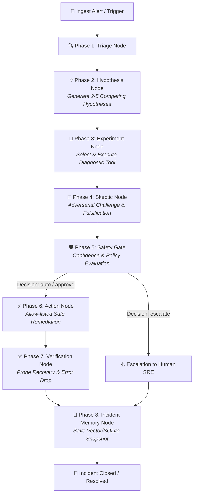

# SYNCODE / Falsify: Autonomous SRE & Incident Remediation

> **Empirically-Driven Autonomous Incident Investigation & Safe Remediation using Scientific Falsification and LangGraph.**

[](#running-tests)
[](#offline-replay-mode)
[](#safety-gate--policy-controls)
[](#interactive-presentation-dashboard)

---

## 📖 Overview

In high-stakes production environments, traditional autonomous AI agents often fail because they suffer from **confirmation bias**—generating a single hypothesis and immediately taking destructive remediation actions without verifying counter-evidence.

**Falsify** is an autonomous SRE incident remediation platform built on the principle of **Scientific Falsification**:
1. **Generates Competing Hypotheses**: Instead of assuming a single root cause, it formulates multiple rival explanations with verifiable, testable predictions.
2. **Executes Targeted Diagnostic Experiments**: Runs safe diagnostic tools (`get_metrics`, `get_logs`, `get_deploy_history`, `probe_dependency`, `get_db_stats`) to evaluate predictions against real telemetry.
3. **Adversarial Skeptic Review**: A dedicated skeptic agent critiques the leading hypothesis, surfaces contradictory signals, and checks for evidence gaps.
4. **Deterministic Confidence Engine**: Confidence is calculated strictly in deterministic application code (`falsify/confidence.py`), applying hard mathematical caps for weak, single-source, or contradicting signals.
5. **Enforced Safety Gate & Blast Radius Policy**: Remediation actions are confined to an explicit allow-list targeting designated demo containers. False alarms result in **zero destructive actions**, and ambiguous cases **escalate to human SREs**.
6. **Closed-Loop Verification & Incident Memory**: Every action is verified with post-remediation health probes and stored in persistent SQLite incident memory for future investigations.

---

## 🏛️ 8-Stage Agent Workflow Architecture



---

## 🎯 5 Core Incident Scenarios

Falsify includes full deterministic support and test fixtures for 5 real-world incident scenarios:

| # | Scenario | Problem Area | Diagnostic Finding | Safety Gate | Outcome & Action |
| :--- | :--- | :--- | :--- | :--- | :--- |
| **1** | `bad_deploy` | `falsify-demo-payment` | Release `v1.2.4` regression with `NullPointerException` | `auto` (High confidence >= 0.80) | `rollback_deploy` to `v1.2.3` → Verified recovered |
| **2** | `db_pool_exhaustion` | `falsify-demo-payment` / `db` | Database connection pool saturated (`100/100`) | `auto` (High confidence >= 0.80) | `restart_service` container → Connection pool cleared |
| **3** | `slow_dependency` | `falsify-demo-inventory` | Downstream inventory latency bottleneck (`2100ms`) | `auto` / `approve` | `scale_service` to 3 replicas → Latency normalizes |
| **4** | `false_alarm` | `falsify-demo-gateway` | Transient scraper spike artifact; logs 100% OK | `escalate` (**NO ACTION**) | Blocks destructive actions; safe dismissal |
| **5** | `ambiguous` | Distributed Mesh | Weak conflicting DNS/socket jitter across services | `escalate` (Below threshold) | Refuses to guess blindly; escalates to human SRE |

---

## 🛡️ Engineering Guarantees & Safety Controls

- **Deterministic Confidence Calculation**:
  - Zero supporting evidence: strictly capped at `0.20`.
  - Contradicting evidence: strictly capped at `0.40`.
  - Fewer than 2 independent sources: strictly capped at `0.60`.
  - Multi-source corroboration + falsified rivals: up to `0.95`.
- **Untrusted Telemetry Sanitization**: All external logs, metrics, and command outputs are sanitized against control characters and wrapped in explicit XML context blocks to prevent prompt injection (`falsify/sanitize.py`).
- **Remediation Allow-List**: Only explicitly permitted actions (`restart_service`, `rollback_deploy`, `scale_service`) can ever be invoked.
- **Demo Container Isolation**: Target service names are validated to ensure only sandboxed demo containers (`falsify-demo-*`) can be modified.
- **Resource & Loop Budgets**: Configurable caps on LLM calls (20), diagnostic tool calls (15), wall-clock execution (300s), and investigation loop iterations (3).

---

## 🖥️ Interactive Presentation Dashboard

The web dashboard (`app/dashboard/index.html`) provides a live, judge-ready interface:
- **8-Stage Interactive Stepper Pipeline**: Real-time visual progress across all investigation stages.
- **Scenario Selector & Playback Controller**: Run simulations with Play, Pause, Step-by-Step, Reset, and Speed controls (1x, 2x, 4x).
- **Live WebSocket Streaming**: Connects to `ws://localhost:8000/ws/events` for real-time backend updates.
- **Deterministic Confidence Meter**: Live score updates with detailed rule explanations.
- **Competing Hypotheses Matrix**: Status badges (`ALIVE`, `FALSIFIED`, `UNCERTAIN`, `LEADER`) with evidence tagging.
- **Adversarial Skeptic Callout & Safety Gate Card**: Transparent policy justifications.
- **Collapsible Event Audit Drawer**: Chronological event timeline following typed envelope contracts.

---

## 🚀 Getting Started

### 1. Prerequisites
- Python 3.10+
- (Optional) Docker & Docker Compose (for live container targets)

### 2. Installation
```bash
git clone https://github.com/ImpactX26/SYNCODE.git
cd SYNCODE
pip install -r requirements.txt
```

### 3. Preflight Check
Run the preflight script to verify your local environment:
```bash
python preflight.py
```

### 4. Running Repository Integrity Verification
```bash
python scripts/check_repo.py
```

---

## 🧪 Running Tests

### Standard Test Suite (Full Coverage)
```bash
pytest
```

### Offline Replay Mode (Deterministic / Zero External Network Calls)
```bash
# Windows PowerShell
$env:REPLAY="1"; pytest; $env:REPLAY=""

# Linux / macOS
REPLAY=1 pytest
```

---

## 🌐 Launching the API & Live Dashboard

Start the FastAPI application server:
```bash
uvicorn app.main:app --host 0.0.0.0 --port 8000 --reload
```

- **Interactive Presentation Dashboard**: [http://localhost:8000](http://localhost:8000) or [http://localhost:8000/dashboard](http://localhost:8000/dashboard)
- **Interactive API Documentation (Swagger UI)**: [http://localhost:8000/docs](http://localhost:8000/docs)
- **Live Event Stream**: `ws://localhost:8000/ws/events`

---

## 📁 Repository Structure

```
SYNCODE/
├── .env.example               # Environment configuration template
├── .gitignore                 # Git ignore rules
├── AGENTS.md                  # Strict engineering guidelines & contracts
├── README.md                  # Project overview & documentation
├── docker-compose.yml         # Mock target demo containers
├── preflight.py               # Preflight environment verification script
├── pytest.ini                 # Pytest test discovery & markers
├── requirements.txt           # Project dependencies
├── app/
│   ├── main.py                # FastAPI server (REST endpoints & WebSockets)
│   └── dashboard/             # Interactive presentation dashboard
│       ├── index.html         # Single-page dashboard markup
│       ├── style.css          # Dark glassmorphism stylesheet
│       ├── app.js             # Dashboard controller & WebSocket client
│       └── mock_data.js       # Fixtures for 5 core scenarios
├── docs/
│   ├── CONTRACTS.md           # Schema, tool signatures, and event contracts
│   ├── SCENARIOS.md           # Specification for 5 core incident scenarios
│   └── STATUS.md              # Project status & milestone tracking
├── eval/
│   └── replay_cache.sqlite    # SQLite replay cache for deterministic execution
├── falsify/
│   ├── budget.py              # Budget limits and loop iteration tracker
│   ├── confidence.py          # Deterministic evidence confidence engine
│   ├── gate.py                # Safety Decision Gate & allow-list policies
│   ├── graph.py               # LangGraph 8-node incident investigation workflow
│   ├── llm.py                 # Resilient LLM client (Retry, Fallback, Replay)
│   ├── memory.py              # Persistent SQLite incident memory store
│   ├── sanitize.py            # Prompt injection defense & output sanitizer
│   ├── scenarios.py           # Deterministic E2E scenario fixtures & runner
│   ├── state.py               # Shared IncidentState & Evidence Pydantic models
│   └── tools/
│       └── base.py            # Diagnostic & remediation tools with @safe_tool
├── scripts/
│   └── check_repo.py          # Repository integrity and context check script
├── targets/
│   └── faults.py              # Target fault injection and simulation module
└── tests/                     # Comprehensive test suite (100% passing)
```

---

## 📜 License

Apache 2.0 / MIT — Built for the Hackathon.